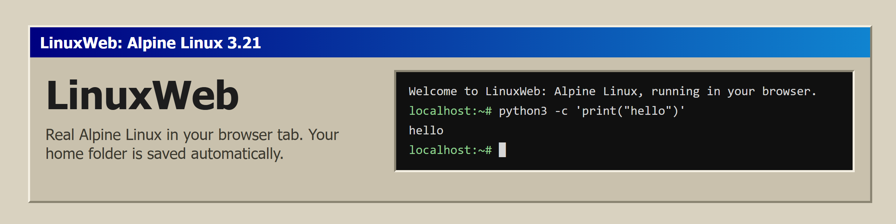
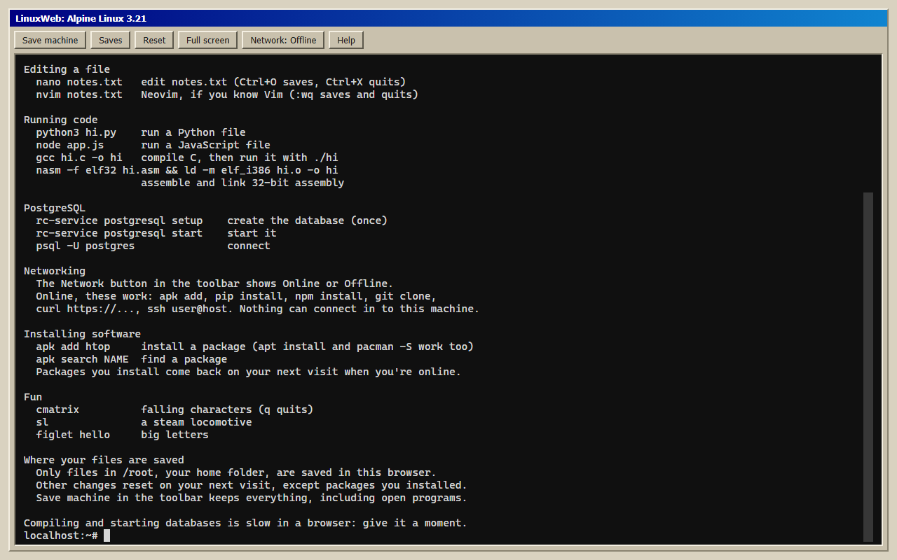

<p align="center"><a href="https://hammadshakeelai.github.io/LinuxWeb/"></a></p>

**Try it:** https://hammadshakeelai.github.io/LinuxWeb/

LinuxWeb runs real Alpine Linux 3.21 in your browser with the [v86](https://github.com/copy/v86) emulator. Nothing to install, and nothing you do can touch your own computer.

<p align="center"></p>

## What you get

- bash, zsh and fish; nano, vim, Neovim, micro and Midnight Commander.
- gcc, g++, make, nasm, gdb, valgrind, cmake, meson and ninja for C, C++ and assembly.
- Python with pip, Node.js with npm, Lua, SQLite, jq and PostgreSQL 17.
- curl, wget, ssh, git, dig, ip, traceroute, nmap, netcat, whois and the w3m text browser.
- btop, bat, ripgrep, fd, fzf, eza, tmux, fastfetch, and cmatrix, sl and figlet for fun.
- `apt`, `apt-get`, `pacman` and `snap` translate to Alpine's `apk`, and a missing command tells you which package provides it.
- Type `help` for a short tour. **Full screen** makes the terminal fill your screen.

## Networking

Linux reaches the internet through a relay, a small server that forwards its connections. Press **Network**, enter a relay address such as `wisps://relay.example.com/`, and press **Save and reload**. Online, `apk add`, `pip install`, `npm install`, `git clone`, `curl` and `ssh` work.

To run your own relay, see [`relay/README.md`](relay/README.md).

Linux's internet traffic goes through the relay you choose. HTTPS stays encrypted, but the relay sees which addresses and ports you connect to. DNS lookups go to Cloudflare.

## What is saved

- **Your home folder (`/root`) is saved in this browser automatically** and restored on your next visit.
- **Packages you install are reinstalled on your next visit** once you're online.
- Other changes outside `/root` reset on your next visit.
- **Save machine** keeps everything, including open programs. You can keep up to 5 saves and download them.
- Saves live in this browser only. Clearing site data removes them.

## Not included

- No incoming connections: servers you start are reachable only from inside the VM.
- No UDP other than DNS, and `ping` only reaches the virtual router.
- No systemd, so no snaps.

## Development

Requires Node 24. Building the Linux image also needs Docker, Python 3 with `zstandard`, and `zstd` (Linux or WSL).

```bash
npm install
npm run image                 # build and test the Linux image into image/out
npm run dev                   # http://localhost:5173/LinuxWeb/
npm test                      # unit tests
npm run build && npm run test:e2e
node relay/server.ts          # a local relay: use wisp://127.0.0.1:8080/ in the Network dialog
```

The designs and the plans they were built from are in `docs/superpowers/`.

## License

MIT. See `THIRD_PARTY_NOTICES.md` for v86, SeaBIOS, xterm.js, Alpine Linux packages, and wisp-js.
